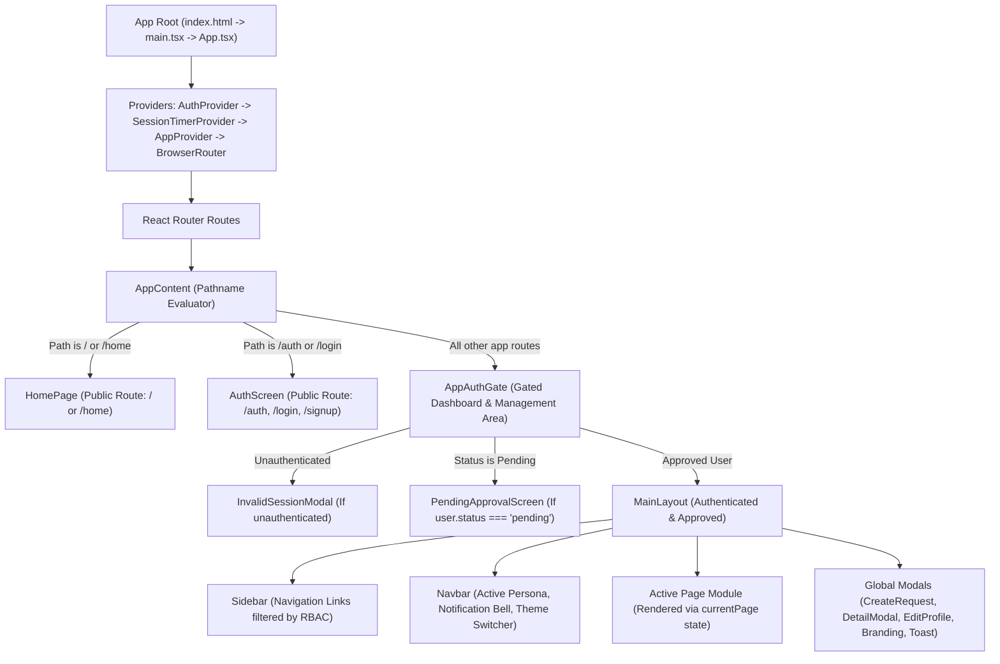

# 📘 E-Gramin CSMP — Comprehensive Developer Guide

Welcome to the **E-Gramin Client Service Management Platform (CSMP)** codebase! This guide is designed as an onboarding and reference manual for engineers. It details the complete system architecture, folder structure, state management patterns, data models, RBAC rules, and step-by-step developer recipes.

---

## 📑 Table of Contents

1. [Architectural Overview & Design Philosophy](#1-architectural-overview--design-philosophy)
2. [Codebase Directory Structure](#2-codebase-directory-structure)
3. [Component Hierarchy & Layout Engine](#3-component-hierarchy--layout-engine)
4. [State Management & Contexts](#4-state-management--contexts)
   - [AuthContext](#41-authcontext)
   - [AppContext](#42-appcontext)
   - [SessionContext](#43-sessioncontext)
5. [Role-Based Access Control (RBAC) System](#5-role-based-access-control-rbac-system)
6. [Data Models & TypeScript Typing](#6-data-models--typescript-typing)
7. [Database Schema & Supabase Data Layer](#7-database-schema--supabase-data-layer)
8. [Indian Financial Services & Holding Engine](#8-indian-financial-services--holding-engine)
9. [Feature Modules Deep Dive](#9-feature-modules-deep-dive)
10. [Security & Session Architecture](#10-security--session-architecture)
11. [Developer How-To Guides (Recipes)](#11-developer-how-to-guides-recipes)
    - [Recipe A: Adding a New Module / Page](#recipe-a-adding-a-new-module--page)
    - [Recipe B: Adding a New Service Request Type or Field](#recipe-b-adding-a-new-service-request-type-or-field)
    - [Recipe C: Modifying the Database Schema](#recipe-c-modifying-the-database-schema)
12. [Coding Standards & Conventions](#12-coding-standards--conventions)

---

## 1. Architectural Overview & Design Philosophy

E-Gramin CSMP is an enterprise Single Page Application (SPA) designed to function reliably in real-world rural banking and customer service point (CSP) environments with intermittent internet access.

### Core Architectural Pillars:
1. **Decoupled Client-Centric Architecture**:
   - The frontend is a high-performance React 19 SPA bundled by Vite 6.
   - All routing is handled client-side via React Router v7 with native HTML5 history mode.
   - Deployed globally on Azure Static Web Apps edge servers with pre-compressed Brotli/Gzip static assets and aggressive caching.
2. **Resilient Dual-Tier Data Layer**:
   - **Tier 1 (Cloud Backend)**: Managed Supabase Cloud (PostgreSQL 15+, Supabase Auth with JWTs, and Realtime WebSocket replication).
   - **Tier 2 (Local Cache & Fallback)**: Structured browser LocalStorage caching engine. If the network drops or Supabase credentials are missing, the UI gracefully falls back to local data without throwing uncaught exceptions. Writes are queued and flushed upon reconnection.
3. **Defense-in-Depth Security**:
   - Authentication tokens are maintained using `cookieStorageAdapter` with `SameSite=Lax` and `Secure` attributes rather than raw unencrypted localStorage tokens.
   - Application-level 15-minute inactivity timer with real-time countdown alerts.
   - Comprehensive CSP (Content Security Policy) and HTTP security headers enforced by Azure SWA.

---

## 2. Codebase Directory Structure

```text
egspl/
├── .github/
│   └── workflows/
│       └── azure-static-web-apps.yml   # CI/CD pipeline for UAT & Prod branches
├── docs/                               # Supplementary project documentation
├── public/
│   ├── favicon.ico                     # Standard ICO browser icon
│   └── favicon.svg                     # High-res SVG favicon (e-gramin gradient shield)
├── scripts/
│   ├── generate-favicon.mjs            # ICO binary generation script
│   ├── migrate.ts                      # Automated PostgreSQL DDL migration runner
│   └── validate-lottie.mjs             # Lottie JSON syntax validator
├── src/
│   ├── assets/
│   │   ├── images/                     # Bank logos, partner logos, banner assets
│   │   └── lottie/                     # Lottie animation vectors (loading, empty, success)
│   ├── components/
│   │   ├── analytics/                  # KPI reporting, charts, workload analytics
│   │   ├── assignments/                # Operator workload balancing & re-assignment
│   │   ├── audit/                      # Immutable audit log ledger & filter view
│   │   ├── auth/                       # Login, registration, session expiry modals
│   │   ├── common/                     # Reusable UI widgets (Badges, Toasts, Lottie, etc.)
│   │   ├── crm/                        # Client/CSP directory, registration approval
│   │   ├── dashboard/                  # Executive metrics overview & quick action triggers
│   │   ├── home/                       # Public responsive landing page
│   │   ├── layout/                     # Main navigation sidebar and top header navbar
│   │   ├── notifications/              # Slide-over notification drawer & logs view
│   │   ├── profile/                    # User account editing & credentials modal
│   │   ├── rbac/                       # Role permission matrix configuration view
│   │   ├── requests/                   # Support tickets & holding fund deposit/withdraw views
│   │   └── settings/                   # System settings, branding & theme customizations
│   ├── context/
│   │   ├── AppContext.tsx              # Core app state: requests, filters, CRM, audit, notifications
│   │   ├── AuthContext.tsx             # Auth lifecycle, user persona, session restoration
│   │   └── SessionContext.tsx          # 15-minute activity tracker & auto-logout modal
│   ├── lib/
│   │   ├── animations.ts               # Framer Motion animation presets and spring curves
│   │   ├── cookieStorage.ts            # Secure cookie storage adapter for Supabase client
│   │   ├── dateUtils.ts                # Date formatting and SLA calculation utilities
│   │   ├── indianCurrency.ts           # Indian numbering system (Lakh/Crore) & Amount In Words
│   │   ├── lottieAssets.ts             # Lottie animation JSON loaders
│   │   ├── security.ts                 # Sanitization, input escaping, and audit hashing
│   │   ├── storage.ts                  # LocalStorage fallback persistence provider
│   │   ├── supabase.ts                 # Supabase client instantiation, DB mappers & retry queue
│   │   ├── theme.ts                    # Dark / Light theme tokens and state hooks
│   │   └── validators.ts               # Form validation rules (IFSC, Account, Email, Phone)
│   ├── types/
│   │   ├── app.type.ts                 # Master domain models (User, ServiceRequest, Audit, etc.)
│   │   └── supabase.types.ts           # Generated / mapped PostgreSQL table definitions
│   ├── App.tsx                         # App routing hierarchy, auth gates, layout wrapper
│   ├── index.css                       # Tailwind CSS imports and custom design system classes
│   ├── main.tsx                        # React application bootstrap entrypoint
│   └── types.ts                        # Root type re-exports
├── supabase/
│   └── schema.sql                      # Complete PostgreSQL DDL schema & initial seed data
├── index.html                          # Root HTML entrypoint with fallback CSP headers
├── package.json                        # Node dependencies, scripts, and engine specs
├── staticwebapp.config.json            # Azure Static Web Apps routing, headers, and MIME rules
├── tsconfig.json                       # TypeScript compiler configuration
└── vite.config.ts                      # Vite bundler plugins, path aliases & Rollup manualChunks
```

---

## 3. Component Hierarchy & Layout Engine

The rendering pipeline in [`src/App.tsx`](file:///src/App.tsx) operates in three cascading layers:



### Key Layout Rules:
- **Zero-Flicker Session Restore**: When the application boots, `useAuth().isInitialLoading` is `true`. `AppAuthGate` displays a `LoadingScreen` until cookie tokens are verified, ensuring protected screens never flash accidentally.
- **Dynamic RBAC Protection**: Within `MainLayout`, before rendering any page module, `isPageAllowed(currentPage)` is invoked. If unauthorized, a friendly `Access Restricted` shield view appears with a button to return to the Dashboard.

---

## 4. State Management & Contexts

State is managed via dedicated React Contexts that interact cleanly with the persistence layer.

### 4.1 `AuthContext` (`src/context/AuthContext.tsx`)
Responsible for user credentials, current identity, and session authentication:
- **`user`**: The active `User` object (ID, role, company, kiosk ID, permissions).
- **`isAuthenticated`**: Boolean flag indicating valid authentication.
- **`switchPersona(role)`**: Enables rapid switching between `admin`, `operator`, and `client` for testing and development.
- **`login(email, password)`**: Supabase Auth password authentication with local fallback.
- **`logout()`**: Clears cookies, local auth cache, and resets app session state.

### 4.2 `AppContext` (`src/context/AppContext.tsx`)
The central operational data hub of the application:
- **Service Requests**: Holds `requests: ServiceRequest[]`, providing actions `createRequest`, `updateRequest`, `deleteRequest`, and `assignOperator`.
- **CRM / Users**: Manages `users: User[]`, approval actions (`approveUser`, `rejectUser`), and role updates.
- **Notifications**: Stores `notifications: Notification[]`, with badge counts, `markAsRead`, and `markAllAsRead`.
- **Audit Logging**: Appends events to `auditLogs: AuditLog[]` with actor IDs, IP timestamps, and target metadata.
- **Active Navigation**: Holds `currentPage: PageId`, `filterState`, and modal visibility toggles.
- **Offline Sync Queue**: If Supabase write operations fail due to a network glitch, requests are placed in an in-memory retry queue (`flushPendingRequestSync`) which automatically re-synchronizes on the next heartbeat.

### 4.3 `SessionContext` (`src/context/SessionContext.tsx`)
Guards compliance by enforcing inactivity timeouts:
- Listens to user interactions (`mousemove`, `keydown`, `click`, `scroll`, `touchstart`).
- Displays a 60-second warning countdown modal before session expiration.
- Auto-logs the user out after 15 minutes of inactivity and clears sensitive tokens.

---

## 5. Role-Based Access Control (RBAC) System

E-Gramin defines three primary personas in [`src/types/app.type.ts`](file:///src/types/app.type.ts):

| Persona | Role Key | Allowed Navigation Modules | Core Capabilities |
| :--- | :--- | :--- | :--- |
| **Administrator** | `admin` | `dashboard`, `support`, `holding`, `all-requests`, `assignments`, `clients`, `analytics`, `rbac`, `audit-logs`, `notifications`, `settings` | Full administrative control, operator assignment, user approval/deletion, system settings, export reports |
| **Operator** | `operator` | `dashboard`, `support`, `holding`, `all-requests`, `assignments`, `clients`, `analytics`, `notifications` | Review tickets, update request status, add internal private notes, view client CRM details |
| **Client / CSP** | `client` | `dashboard`, `support`, `holding` | Create support tickets, create deposit/withdrawal requests, view own ticket progress |

### Evaluating Permissions in Components:
```tsx
import { useApp } from '@/context/AppContext';
import { useAuth } from '@/context/AuthContext';

const MyComponent = () => {
  const { user } = useAuth();
  const { isPageAllowed, permissions } = useApp();

  // Check page access
  if (!isPageAllowed('rbac')) {
    return <AccessDenied />;
  }

  // Check specific capability
  const canAssign = permissions[user.role]?.canAssignOperator;
  return canAssign ? <AssignDropdown /> : null;
};
```

---

## 6. Data Models & TypeScript Typing

All master domain types reside in [`src/types/app.type.ts`](file:///src/types/app.type.ts):

### User Model (`User`)
```typescript
export interface User {
  id: string;                      // e.g. "usr_1741160000"
  authUserId?: string;             // Supabase auth UUID
  name: string;
  email: string;
  role: 'admin' | 'operator' | 'client';
  avatarUrl?: string;
  companyName?: string;
  phoneNumber?: string;
  account?: string;                // Kiosk bank account number
  ifsc?: string;                   // Bank IFSC code
  bank?: string;                   // Associated Bank (SBI, HDFC, ICICI, etc.)
  kioskId?: string;                // CSP Kiosk Identifier (e.g. "KIO-7701")
  estimatedHoldingBalance?: number;// Current wallet / holding funds (INR)
  currency: string;                // Default: "INR"
  status: 'active' | 'pending' | 'suspended';
  createdAt: string;
}
```

### Polymorphic Service Request Model (`ServiceRequest`)
Service requests are union-typed across three operations:
1. **`SupportTicket`**: Technical helpdesk issues (biometrics, software, transaction disputes).
2. **`HoldingDepositRequest`**: Fund updates for wallet balance replenishment.
3. **`HoldingWithdrawRequest`**: Payout authorizations to recipient accounts.

```typescript
export type ServiceRequest = SupportTicket | HoldingDepositRequest | HoldingWithdrawRequest;
```

Common fields shared across all requests:
- `id`, `ticketNumber` (e.g. `TCK-2026-101-ABCD` or `HLD-2026-201-XYZ`)
- `type`: `'support' | 'deposit' | 'withdraw'`
- `status`: `'open' | 'in_progress' | 'pending_approval' | 'resolved' | 'rejected' | 'closed'`
- `priority`: `'low' | 'medium' | 'high' | 'urgent'`
- `clientId`, `clientName`, `clientEmail`, `kioskId`
- `assignedOperatorId`, `assignedOperatorName`
- `comments: Comment[]` (supports `isInternal: boolean` for staff-only private notes)
- `attachments: Attachment[]` (URL, name, size, type)

---

## 7. Database Schema & Supabase Data Layer

The database schema is defined in [`supabase/schema.sql`](file:///supabase/schema.sql) and mirrored in TypeScript by [`src/lib/supabase.ts`](file:///src/lib/supabase.ts).

### Primary Database Tables:
- **`csmp_users`**: User records, kiosk identifiers, banking details, holding balances, and account statuses.
- **`csmp_requests`**: Master requests table with polymorphic JSON/column fields (`cma_status`, `attachments`, `comments`).
- **`csmp_role_permissions`**: Allowed pages and capabilities per role.
- **`csmp_audit_logs`**: Chronological event trail (actor ID, action, target, timestamp, IP).
- **`csmp_notifications`**: In-app notifications linked to user IDs or broadcast targets (`all_operators`, `all_admins`).

### Running Migrations:
The automated migration runner in [`scripts/migrate.ts`](file:///scripts/migrate.ts) applies `schema.sql` directly to your Supabase PostgreSQL instance:
```bash
npm run db:migrate
```
It reads `DATABASE_URL` from `.env.local`, verifies SSL connectivity, applies DDL statements, and prints row counts for each table.

---

## 8. Indian Financial Services & Holding Engine

A distinguishing feature of E-Gramin CSMP is its native support for the **Indian Financial System**:
- **Indian Numbering Formatting**: [`src/lib/indianCurrency.ts`](file:///src/lib/indianCurrency.ts) formats amounts into standard Lakhs and Crores (e.g., `₹ 12,50,000.00`).
- **Amount in Words Generator**: Automatically converts numeric values into legal Indian currency words:
  - `150000` ➔ `"Rupees One Lakh Fifty Thousand Only"`
  - `2500.50` ➔ `"Rupees Two Thousand Five Hundred and Fifty Paise Only"`
- **Kiosk Wallet Balance Lifecycle**:
  - Submitting a **Deposit Request** creates a pending transaction. Once an Operator marks it as `resolved`, the client's `estimatedHoldingBalance` increments automatically.
  - Submitting a **Withdrawal Request** verifies available balance, generates dual-control authorization stages, and decrements upon final execution.

---

## 9. Feature Modules Deep Dive

### 9.1 Technical Support Ticket Management (`src/components/requests/`)
- **Intake Flow**: Clients select issue category (mATM hardware, biometric scanner, portal software, billing) and priority.
- **Operator Assignment**: Admin or Operators can assign tickets to specific staff members with real-time notifications.
- **Dual Conversation Threads**: Staff can toggle between **Public Response** (visible to client) and **Internal Note** (highlighted in yellow, restricted to staff).

### 9.2 Financial Holding Operations (`src/components/requests/HoldingRequestsView.tsx`)
- Tabbed view separating **Deposit Updates** and **Withdrawal Authorizations**.
- Direct visual verification of transaction reference codes, bank slip uploads, and sender accounts.
- Resolution triggers celebratory `canvas-confetti` animations to give operators clear visual confirmation of completed transactions.

### 9.3 Client CRM Directory (`src/components/crm/ClientDirectory.tsx`)
- Grid and table views of all registered CSP kiosks and agents.
- **Approval Pipeline**: New registrations default to `pending` status. Admins can inspect bank account details, approve into `active` status, or reject with feedback.

### 9.4 Executive Analytics Dashboard (`src/components/analytics/AnalyticsView.tsx`)
- Powered by [Recharts](https://recharts.org/).
- Visualizes ticket intake trends over time, request category distributions, resolution SLA breach rates, and operator volume distribution.

---

## 10. Security & Session Architecture

1. **Content Security Policy (CSP)**:
   - Configured in [`staticwebapp.config.json`](file:///staticwebapp.config.json) and mirrored in [`index.html`](file:///index.html).
   - Whitelists only necessary origins: Supabase REST/WebSocket (`https://*.supabase.co`, `wss://*.supabase.co`), Google Fonts (`https://fonts.googleapis.com`), and DiceBear avatars.
2. **SameSite & Secure Cookie Storage**:
   - Implemented in [`src/lib/cookieStorage.ts`](file:///src/lib/cookieStorage.ts).
   - Intercepts Supabase Auth token persistence to store tokens in cookies with `SameSite=Lax` and `Secure` flags, mitigating XSS exfiltration risks.
3. **Inactivity Auto-Logout**:
   - Monitored by [`src/context/SessionContext.tsx`](file:///src/context/SessionContext.tsx).
   - Inactivity after 14 minutes displays a countdown modal; at 15 minutes, the session is purged.

---

## 11. Developer How-To Guides (Recipes)

### Recipe A: Adding a New Module / Page

1. **Create the View Component**:
   Create `src/components/mymodule/MyModuleView.tsx`:
   ```tsx
   import React from 'react';

   export const MyModuleView: React.FC = () => {
     return (
       <div className="p-6">
         <h1 className="text-2xl font-bold">My New Module</h1>
       </div>
     );
   };
   ```

2. **Register the Page ID**:
   In `src/types/app.type.ts`, add your new page key to `PageId`:
   ```typescript
   export type PageId =
     | 'dashboard'
     | 'support'
     | 'holding'
     | 'all-requests'
     | 'assignments'
     | 'clients'
     | 'analytics'
     | 'rbac'
     | 'audit-logs'
     | 'notifications'
     | 'settings'
     | 'mymodule'; // <-- Add here
   ```

3. **Define Page Metadata**:
   In `src/types/app.type.ts`, add to `APP_PAGE_DEFINITIONS`:
   ```typescript
   { id: 'mymodule', label: 'My Module', icon: 'FolderPlus', description: 'Custom module description' },
   ```

4. **Add to Navigation & RBAC**:
   In `src/lib/supabase.ts`, add `'mymodule'` to `INITIAL_ROLE_PERMISSIONS.admin.allowedPages`.

5. **Mount in MainLayout**:
   In `src/App.tsx`:
   - Import `MyModuleView`.
   - Add `case 'mymodule': return <MyModuleView />;` to `renderPage()`.
   - Add `<Route path="/mymodule" element={<AppContent />} />` to the router.

---

### Recipe B: Adding a New Service Request Type or Field

1. **Update Domain Interface**:
   In `src/types/app.type.ts`, add your property to `SupportTicket` or `HoldingDepositRequest`.
2. **Update Database Mappers**:
   In `src/lib/supabase.ts`:
   - Update `mapDbRequest` to read the column from the database row.
   - Update `mapRequestToDb` to write the property to the database payload.
3. **Update UI Modal / Detail View**:
   - Add the input field to `src/components/requests/CreateRequestModal.tsx`.
   - Add the display section to `src/components/requests/RequestDetailModal.tsx`.

---

### Recipe C: Modifying the Database Schema

1. **Edit DDL**:
   Add your `ALTER TABLE` or `CREATE TABLE` statements in `supabase/schema.sql`.
2. **Run Local Migration**:
   ```bash
   npm run db:migrate
   ```
3. **Verify Table**:
   The migration script logs row counts to confirm table integrity.

---

## 12. Coding Standards & Conventions

- **TypeScript**: Strict typing is enforced. Avoid `any` where possible. Run `npm run lint` (`tsc --noEmit`) to verify.
- **Component Architecture**: Keep components focused. Reusable visual components go into `src/components/common/`.
- **Styling**: Use utility classes from Tailwind CSS v4. Support dark mode with `dark:` variants for all background and text colors.
- **Formatting Numbers**: Always format currency figures with `formatIndianCurrency(amount)` from `src/lib/indianCurrency.ts`.
- **Icons**: Import modern Lucide icons from `lucide-react`.
- **Commit Cleanliness**: Never commit `.env` or `.env.local` files containing secrets or private CA certs.
