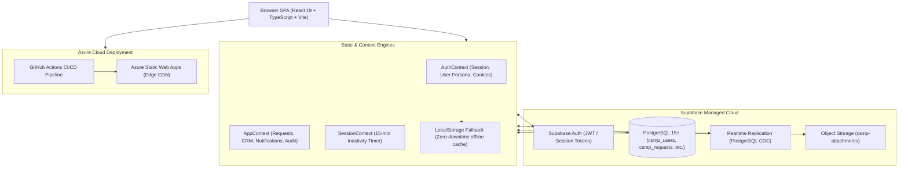

# 🌾 E-Gramin — Client Service Management & CRM Platform (CSMP)

[](https://react.dev/)
[](https://www.typescriptlang.org/)
[](https://vitejs.dev/)
[](https://tailwindcss.com/)
[](https://supabase.com/)
[](https://azure.microsoft.com/services/app-service/static/)

Enterprise-grade **Client Service Management Platform (CSMP)** and **CRM Directory** built for **E-Gramin**, powering digital financial inclusion, customer service point (CSP/kiosk) operations, holding fund governance, technical support ticketing, and multi-tenant Role-Based Access Control (RBAC).

---

## 📑 Table of Contents

- [Overview & Capabilities](#-overview--capabilities)
- [Key Features](#-key-features)
- [System Architecture](#-system-architecture)
- [Tech Stack](#-tech-stack)
- [Quick Start & Local Setup](#-quick-start--local-setup)
- [Default Personas & Test Credentials](#-default-personas--test-credentials)
- [Available Scripts](#-available-scripts)
- [Deployment](#-deployment)
- [Developer & Architecture Guides](#-developer--architecture-guides)

---

## 🌟 Overview & Capabilities

**E-Gramin CSMP** connects rural banking correspondents, customer service points (CSPs), and operators with enterprise banking and citizen service channels:
- **Banking & Insurance Kiosk Ops**: Deposit update requests, holding wallet withdrawal authorizations, branch routing, and settlement ledger tracking.
- **Technical Support Helpdesk**: Real-time ticketing for biometric scanner / micro-ATM (mATM) errors, transaction disputes, and gateway connectivity.
- **Compliance & Role Governance**: Dynamic 3-tier RBAC (`admin`, `operator`, `client`), immutable audit logging, and dual-control fund approval flows.
- **High-Resilience Architecture**: Dual-layer persistence with live Supabase PostgreSQL + automated offline-first LocalStorage fallback engine.

---

## ✨ Key Features

| Feature Module | Description | Target Users |
| :--- | :--- | :--- |
| **Public Portal & Services Showcase** | Responsive landing page showcasing CSP services (banking, insurance, pensions, micro-ATM) with direct login / registration links. | Public, Prospective Kiosk Owners |
| **Executive KPI Dashboard** | Interactive charts (Recharts), SLA breach warnings, active request tracking, holding balance aggregates, and quick-action modals. | Admin, Operator |
| **Technical Support Ticketing** | Structured intake with priority tags, category sorting (mATM, software, account, billing), multi-attachment uploads, public client replies, and internal private staff notes. | All Roles |
| **Holding Account & Fund Ops** | Deposit slip submissions, dual-authorized withdrawals, Indian numbering system currency conversions (`Rupees ... Only`), and live balance adjustments. | All Roles |
| **Master Service Ledger** | Comprehensive searchable and filterable ledger across all requests with instant CSV audit reporting exports. | Admin, Operator |
| **Client CRM Directory** | Central directory of registered CSPs and clients, featuring approval pipelines for new registrations and profile governance. | Admin, Operator |
| **Granular RBAC Matrix** | Interactive matrix view of allowed page modules and permissions per role. | Admin |
| **Audit Logs & Notifications** | Immutable chronological record of system events, operator assignments, and real-time toast / drawer notifications. | Admin, Operator |
| **Session Security & Theming** | 15-minute inactivity auto-logout, secure cookie token storage, dark/light theme switching, and white-label branding customization. | All Roles |

---

## 🏛 System Architecture



---

## 🛠 Tech Stack

- **Frontend Core**: [React 19](https://react.dev/), [TypeScript 5.8](https://www.typescriptlang.org/), [Vite 6](https://vitejs.dev/)
- **Routing**: [React Router v7](https://reactrouter.com/) (HTML5 History API with SPA rewrites)
- **Styling**: [Tailwind CSS v4](https://tailwindcss.com/) with native CSS variables and dark mode
- **UI & Motion**: [Lucide React](https://lucide.dev/), [Motion](https://motion.dev/) (Framer Motion), [Lottie React](https://github.com/Gamote/lottie-react), [Canvas Confetti](https://www.npmjs.com/package/canvas-confetti)
- **Data Visualizations**: [Recharts v3](https://recharts.org/)
- **Backend & Database**: [Supabase](https://supabase.com/) (PostgreSQL 15+, Supabase Auth, Realtime WebSockets, Storage)
- **Database Migrations**: [tsx](https://github.com/privatenumber/tsx) + [node-postgres (`pg`)](https://node-postgres.com/)
- **Hosting & CI/CD**: [Azure Static Web Apps](https://azure.microsoft.com/services/app-service/static/) via [GitHub Actions](https://github.com/features/actions)

---

## 🚀 Quick Start & Local Setup

### Prerequisites
- [Node.js](https://nodejs.org/) v20.x or higher
- [npm](https://www.npmjs.com/) v10.x or higher
- A [Supabase](https://supabase.com/) project (free or pro tier) or local Supabase instance

### 1. Clone & Install
```bash
git clone https://github.com/your-org/egspl.git
cd egspl
npm install
```

### 2. Configure Environment Variables
Copy `.env.example` to `.env.local` and populate your credentials:
```bash
cp .env.example .env.local
```

```env
# Supabase Configuration
VITE_SUPABASE_URL="https://<your-project-ref>.supabase.co"
VITE_SUPABASE_ANON_KEY="<your-anon-key>"

# Optional: PostgreSQL direct connection for automated migrations
DATABASE_URL="postgresql://postgres.<project-ref>:<password>@aws-0-<region>.pooler.supabase.com:5432/postgres"
```

### 3. Run Database Schema Migration (Optional)
If provisioning a new Supabase database, execute the automated migration:
```bash
npm run db:migrate
```
*(Alternatively, copy and paste `supabase/schema.sql` into the Supabase SQL Editor.)*

### 4. Start Development Server
```bash
npm run dev
```
Open [http://localhost:3000](http://localhost:3000) in your browser.

---

## 👥 Default Personas & Test Credentials

The platform includes demo personas for immediate testing (or you can create accounts via the `/auth` registration form):

| Role | Email | Password | Allowed Capabilities |
| :--- | :--- | :--- | :--- |
| **Admin** | `admin@egramin.in` | `Admin@123` | Full access: All requests, User CRM, RBAC matrix, Audit logs, System Settings |
| **Operator** | `operator@egramin.in` | `Operator@123` | Operational access: Dashboard, Support helpdesk, Fund requests, CRM Directory |
| **Client (CSP)** | `client@egramin.in` | `Client@123` | Client access: Kiosk dashboard, Submit support tickets, Submit holding deposits/withdrawals |

> *Note: If Supabase credentials are not configured, the app seamlessly activates an in-memory mock engine allowing full UI exploration without database dependencies.*

---

## 📜 Available Scripts

| Command | Purpose |
| :--- | :--- |
| `npm run dev` | Starts Vite local development server at `http://0.0.0.0:3000` |
| `npm run build` | Compiles TypeScript and builds optimized production bundles into `dist/` |
| `npm run preview` | Previews production build locally on port 4173 |
| `npm run lint` | Runs TypeScript type checker (`tsc --noEmit`) |
| `npm run clean` | Cross-platform cleanup script that safely deletes `dist/` |
| `npm run db:migrate` | Runs PostgreSQL database migration and seeds initial tables |

---

## ☁️ Deployment

This project is deployed to **Azure Static Web Apps** through GitHub Actions.
- **Workflow configuration**: [`.github/workflows/azure-static-web-apps.yml`](file:///.github/workflows/azure-static-web-apps.yml)
- **Routing & Security configuration**: [`staticwebapp.config.json`](file:///staticwebapp.config.json)
- **Deployment Guide**: For complete production setup, environment secrets, and custom domains, refer to [DEPLOYMENT.md](file:///DEPLOYMENT.md).

---

## 📚 Developer & Architecture Guides

For detailed technical documentation, please consult:
- **[DEVELOPER_GUIDE.md](file:///DEVELOPER_GUIDE.md)**: Deep dive into the architecture, state management, directory structure, data models, RBAC rules, security policies, and how to add new features.
- **[DEPLOYMENT.md](file:///DEPLOYMENT.md)**: Complete guide to Azure Static Web Apps, GitHub Actions CI/CD secrets, and Supabase cloud setup.
